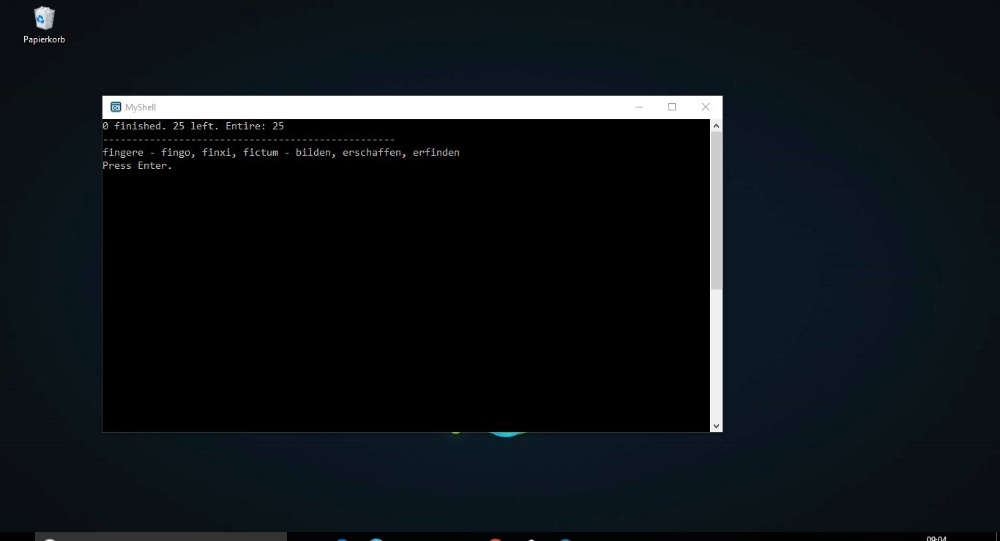
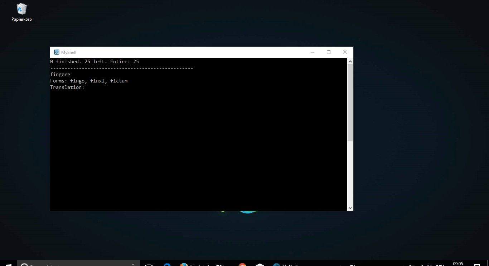

## Decription ##
This is a small and easy to use vocabulary trainer for any language (purpose-built for latin and english) as a Console Application written in Python. The method to learn vocabulary that is represented with this application you can look up <a href="https://www.youtube.com/watch?v=VBw2m5PYIm0">here</a> (german video, thanks to the man who created that method).

The current version was tested with Python 3.4 but should work with every Python 3.x version.

version: 1.1.0

## NOTE
* Make sure you have Python installed
* To change the used text file (vocab-file) open **vocab_settings.txt** and change the path
    * add another file for your own vocab
    * see how the files of both modes have to look like by having a look at the examples in the directory **vocab-files/**
* specify the mode you want to choose in the settings-file as well
    * Mode 1: file contains only the word and its translation (only translation will be tested)
    * Mode 2: files also contains from you specified forms and will be tested as well

## Screenshots

